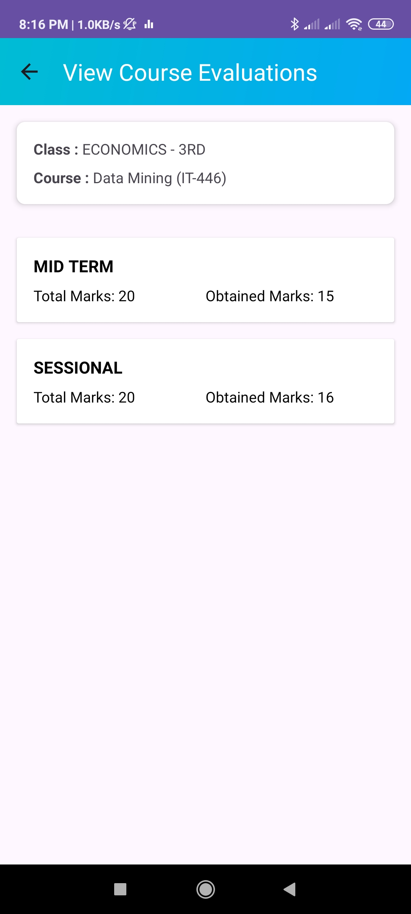

# Smart Teacher Assistant (Andriod App) - Universal LMS

The Smart Teacher Assistant is an Android application designed to simplify academic management for both institutions and individual users. It provides a user-friendly interface for administrators, teachers, and students to manage attendance, assessments, and reports efficiently.

## Admin UI Screenshots

Here are all the screenshots of the Admin UI:

  
  
  
  
  
  
  
  
  
  
  
  
  
  
  
    
    

# Report Previews (PDFs)

## App Generated Student Wise Report (PDF Preview) - Admin

  
  
  
  

## App Generated Term/Semester Wise Teacher Attendance Report (PDF Preview) - Admin

  

## App Generated Report from the (Admin UI)

Below are the reports generated from the Admin UI:

- [Download Complete Report (MARYAM MEHBOOB(9202) SPRING 2024 — Complete Report.pdf)](AdminUIScreenshots/MARYAM%20MEHBOOB(9202)%20SPRING%202024%20%E2%80%94%20Complete%20Report.pdf)
- [Download Teacher Attendance Report (Teacher Attendance Report — SPRING 2024.pdf)](AdminUIScreenshots/Teacher%20Attendance%20Report%20%E2%80%94%20SPRING%202024.pdf)

# Teacher UI Screenshots

Here are all the screenshots of the Teacher UI:

  
  
  
  
  
  
  
  
  
  
    
    
    
    
    
  
  
  
  

# Report Previews (Excel & PDF)

### App Generated Course Attendance Summary Report (PDF file preview) - Teacher

  

### App Generated Course Complete Attendance Report (Excel file preview) - Teacher

  

### App Generated Course Complete Evaluation Report (Excel file preview) - Teacher

  

## App Generated Specific Evaluation Report (PDF file preview) - Teacher

  

###  App Generated Course Complete Report (Excel file Preview) - Teacher

  

## App Generated Report from the Teacher UI

Below are the reports generated from the Teacher UI:

- [Download MID TERM Report (MID TERM — Software Engineering (IT-223) — ECONOMICS - 3RD — SPRING 2024.pdf)](TeacherUIScreenshots/MID%20TERM%20%E2%80%94%20Software%20Engineering%20(IT-223)%20%E2%80%94%20ECONOMICS%20-%203RD%20%E2%80%94%20SPRING%202024.pdf)
- [Download Attendance Report (Attendance Report — Mobile App Development (IT-407) — ECONOMICS - 3RD — SPRING 2024.pdf)](TeacherUIScreenshots/Attendance%20Report%20%E2%80%94%20Mobile%20App%20Development%20(IT-407)%20%E2%80%94%20ECONOMICS%20-%203RD%20%E2%80%94%20SPRING%202024.pdf)
- [Download Attendance Report Excel (Attendance Report — Mobile App Development (IT-407) — ECONOMICS - 3RD — SPRING 2024.xlsx)](TeacherUIScreenshots/Attendance%20Report%20%E2%80%94%20Mobile%20App%20Development%20(IT-407)%20%E2%80%94%20ECONOMICS%20-%203RD%20%E2%80%94%20SPRING%202024.xlsx)
- [Download Complete Report Excel (Complete Report  — Mobile App Development (IT-407) — ECONOMICS - 3RD — SPRING 2024.xlsx)](TeacherUIScreenshots/Complete%20Report%20%20%E2%80%94%20Mobile%20App%20Development%20(IT-407)%20%E2%80%94%20ECONOMICS%20-%203RD%20%E2%80%94%20SPRING%202024.xlsx)
- [Download Evaluation Report Excel (Evaluation Report  — Mobile App Development (IT-407) — ECONOMICS - 3RD — SPRING 2024.xlsx)](TeacherUIScreenshots/Evaluation%20Report%20%20%E2%80%94%20Mobile%20App%20Development%20(IT-407)%20%E2%80%94%20ECONOMICS%20-%203RD%20%E2%80%94%20SPRING%202024.xlsx)

# Student UI Screenshots

Here are all the screenshots of the Student UI:

  
  
  
  
  
  
  
  
  
  
    

## App Features

- Institute Signup
- Solo Signup

## Institute Signup Features
Contain Three Roles
- Admin
- Teacher
- Student
- 
### Academic Year/Semester Management - Admin
- Add academic years or semesters (e.g., Fall-2024, Term 2024).

### Class Management - Admin
- Add classes and students via Excel file or manually.
- Automatically Student Users Accounts Created that can be downloaded via file and can be shared to students for logging into app.

### Course Assignment - Admin
- Assign courses to classes manually or via Excel file.

### Attendance Reports - Admin 
- View and generate teachers' attendance reports.
- Share reports in Excel format.

### Student Reports - Admin
- View and share comprehensive reports for each student, including attendance and assessments, in a single PDF.
- Share reports via WhatsApp.

### Repeaters Management - Admin
- Add repeaters for courses.

### Course Assignment to Teachers - Admin
- Assign courses to teachers through the UI.

### Role Management - Admin
- Register Institute Teachers accounts

### User Permissions
- Manage user accounts (activate, deactivate, reset passwords for teachers).

# Teacher Features

### Attendance Management - Teacher
- Mark attendance for assigned courses.

### Assessment Management - Teacher
- Add assessments (quizzes, assignments, presentations).

### Course Wise Reports - Teachers
- View and generate attendance reports in Excel and PDF formats.
- View and generate student evaluation reports.
- Share reports via WhatsApp.

### Quiz Management - Teacher
- Create and save quizzes for students.

# Student Features - Students

### Attendance Report - Students
- View self-attendance report within the app.

### Evaluation Report - Students
- View self-evaluation reports.

### Quiz Participation - Students
- Solve and submit quizzes created by teachers.
- View Quiz Results

# Solo Setup

- This setup integrates both admin and teacher functionalities. After adding classes, the user will be able to perform all the actions and functions available to a teacher.

#### Academic Year/Semester Management - Solo User
- Add academic years or semesters.

#### Class Management - Solo User
- Add classes and students.(Excel file & Manual Method)

#### Course Management - Solo User
- Add Courses for classes (Excel file & Manual Method)

#### Student Wise Complete Reports - Solo User
- Generate and share student reports (attendance + assessments) in PDF format.

#### Repeaters Management - Solo User
- Add repeaters for courses.

#### Attendance and Assessment Management - Solo User
- Mark attendance and add assessments.

#### Quiz Management - Solo User
- Create and save quizzes for students.

# Student Features (Solo Setup Also Include Student Role)

#### Attendance Report - Student
- View self-attendance report.

#### Evaluation Report - Student
- View self-evaluation reports.

#### Quiz Participation - Student
- Solve and submit quizzes.
- View Quiz Results

## Tool & Technologies

- **IDE**: Android Studio
- **Front-End**: XML
- **Backend Language**: Java
- **Database**: Firebase Firestore
- **Authentication**: Firebase Authentication

### Libraries
- **Android POI**: For Excel report generation
- **MPAndroidChart**: For visualizing attendance in charts
- **iText**: For PDF report generation
- **Gson**: For offline data storage (Faciliate mark attendance & add assessments report when no internet available)
- **Lottie Animation**: For loading animations
- **RecyclerView**: For data displaying

## App Usage Presentation:

 - [Open Here](https://docs.google.com/presentation/d/1D-RV3ANlxJqHKA__D1baOULq2mufVF08/edit#slide=id.p46)
