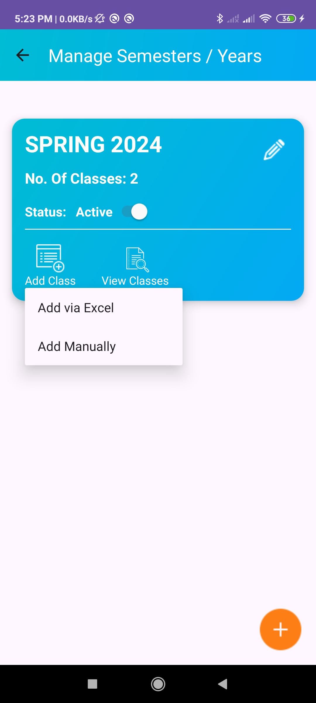

# Smart Teacher Assistant (Andriod App)

The Smart Teacher Assistant is an Android application designed to simplify academic management for both institutions and individual users. It provides a user-friendly interface for administrators, teachers, and students to manage attendance, assessments, and reports efficiently.

# Admin UI Screenshots

Here are all the screenshots of the Admin UI:

  
  
  
  
  
  
  
  
  
  
  
  
  
  
  

## App Generated Report from the Admin UI

Below are the reports generated from the Admin UI:

- [Download Complete Report (MARYAM MEHBOOB(9202) SPRING 2024 — Complete Report.pdf)](AdminUIScreenshots/MARYAM%20MEHBOOB(9202)%20SPRING%202024%20%E2%80%94%20Complete%20Report.pdf)
- [Download Teacher Attendance Report (Teacher Attendance Report — SPRING 2024.pdf)](AdminUIScreenshots/Teacher%20Attendance%20Report%20%E2%80%94%20SPRING%202024.pdf)

## App Usage Presentation (Screenshot of app included also)

 - [Open Here](https://docs.google.com/presentation/d/1D-RV3ANlxJqHKA__D1baOULq2mufVF08/edit#slide=id.p46) (Note : Download and Open in MS Powerpoint for complete usage view)

## App Features

- Institute Signup
- Solo Signup

## Institute Signup Features

### Academic Year/Semester Management
- Add academic years or semesters (e.g., Fall-2024, Term 2024).

### Class Management
- Add classes and students via Excel file or manually.

### Course Assignment
- Assign courses to classes manually or via Excel file.

### Attendance Reports
- View and generate teachers' attendance reports.
- Share reports in Excel format.

### Student Reports
- View and share comprehensive reports for each student, including attendance and assessments, in a single PDF.
- Share reports via WhatsApp.

### Repeaters Management
- Add repeaters for courses.

### Course Assignment to Teachers
- Assign courses to teachers through the UI.

### Role Management
- Create roles for teachers and students.

### User Permissions
- Manage user accounts (activate, deactivate, reset passwords for teachers).

## Teacher Features

### Attendance Management
- Mark attendance for assigned courses.

### Assessment Management
- Add assessments (quizzes, assignments, presentations).

### Reports
- View and generate attendance reports in Excel and PDF formats.
- View and generate student evaluation reports.
- Share reports via WhatsApp.

### Quiz Management
- Create and save quizzes for students.

## Student Features

### Attendance Report
- View self-attendance report within the app.

### Evaluation Report
- View self-evaluation reports.

### Quiz Participation
- Solve and submit quizzes created by teachers.

## Solo Setup

### Admin Features

#### Academic Year/Semester Management
- Add academic years or semesters.

#### Class Management
- Add classes and students.(Excel file & Manual Method)

#### Course Management
- Add Courses for classes (Excel file & Manual Method)

#### Reports
- Generate and share student reports (attendance + assessments) in PDF format.

#### Repeaters Management
- Add repeaters for courses.

#### Attendance and Assessment Management
- Mark attendance and add assessments.

#### Quiz Management
- Create and save quizzes for students.

### Student Features

#### Attendance Report
- View self-attendance report.

#### Evaluation Report
- View self-evaluation reports.

#### Quiz Participation
- Solve and submit quizzes.

## Technologies

- **IDE**: Android Studio
- **Front-End**: XML
- **Backend Language**: Java
- **Database**: Firebase Firestore
- **Authentication**: Firebase Authentication

### Libraries
- **Android POI**: For Excel report generation
- **MPAndroidChart**: For visualizing attendance in charts
- **iText**: For PDF report generation
- **Gson**: For offline data storage (Faciliate mark attendance & add assessments report when no internet available)
- **Lottie Animation**: For loading animations
- **RecyclerView**: For data displaying
